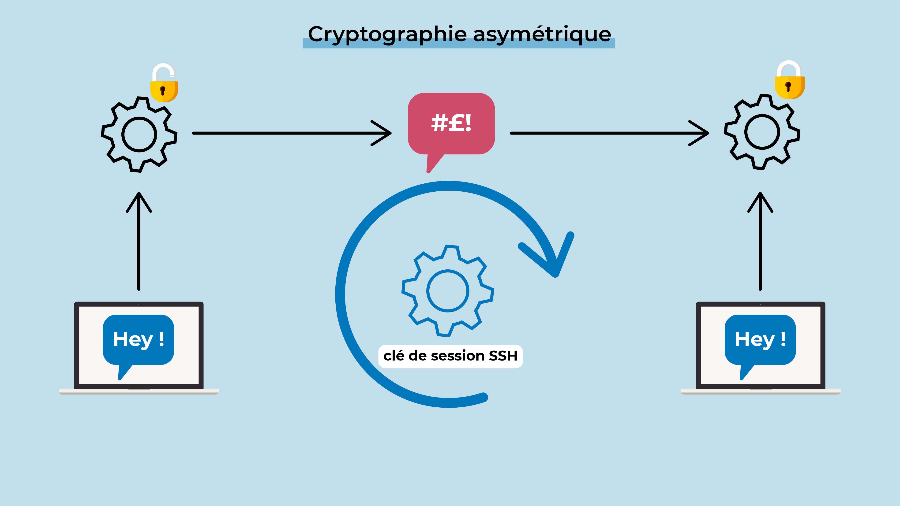

#################################################################################################
#################################################################################################
# Configurez les cartes réseaux

La plupart du temps, votre serveur Linux sera installé au fin fond d'une salle blanche avec nombreux de ses cousins, et son administration s'effectuera à distance via un terminal. Mais ce mode opératoire n'est rendu possible qu'à la condition que votre serveur soit lui-même connecté sur un réseau.  

Je vous propose de voir tout ce qui concerne la configuration réseau d'un serveur Linux, que ce soit :

* le nom réseau de la machine
* la détection des périphériques interfaces par le noyau
* l'emplacement des fichiers de configuration
* les différents modes d'adresse IP
* les routes et passerelles
* et les services de noms (DNS)

La configuration du réseau sous Linux est un aspect qui varie fortement entre les distributions. En effet, chaque distribution aura tendance à installer les outils qui lui sont propres pour gérer le réseau. Vous pourrez notamment trouver **NetworkManager**, **Connection-Manager**, ou encore **dhcpcd**.  

Nous allons faire abstraction de ces différents outils et passer en revue la configuration manuelle du réseau via un processus démon. Ce processus gère :

* le montage ou le démontage des interfaces,
* les fichiers de configuration sur les distributions majoritaires en entreprise : **RedHat** (et ses dérivés) et **Debian** (et ses dérivés).

Normalement, avec cette méthode, vous serez en mesure de configurer le réseau sur toutes les distributions.
Je vous expliquerai les différences qu’il y a entre les branches **RedHat** et **Debian** lorsque ce sera nécessaire.

## Configurez le nom du réseau de votre serveur

Premier élément de configuration réseau du serveur : **son nom réseau**.  

Le nom réseau d'un serveur Linux (aussi appelé "system hostname") sert d'identifiant par défaut de la machine pour tous les services et applications qui s'exécutent en local et pour beaucoup de services et d'applications lorsque ceux-ci communiquent sur le réseau.  
Prenez l'exemple d'un serveur de fichiers logs centralisés sur un réseau interne : toutes les communications logs des serveurs du réseau seront préfixées de leur nom réseau, ce qui permettra au service de centralisation des logs de savoir d'où viennent tels ou tels fichiers. On peut l;obtenir de differentes facon:

    1. cat /proc/sys/kernel/hostname
    2. sysctl kernel.hostname
    3. hostnamectl status (qui renvois plus d'info)

Du coup on pourrait modifier ce nom grace a la commnande:

    hostnamectl set-hostname nouveau_nom

Ou manuelement en modifant le fichier se situant dans /etc/hostname  

Si tous les serveurs de logs ont le même nom réseau (par exemple localhost qui est proposé pendant le processus d'installation), difficile de reconnaître l'origine des fichiers communiqués.  

Il est de coutume de le garder sous un format très simple, le plus souvent, un mot, représentant un champ lexical commun entre plusieurs serveurs.
Si on utilise par exemple "vega", pour l'étoile principale de la constellation de la Lyre. Ainsi, mes différents serveurs pourraient se nommer également avec des noms d'étoile (deneb,  altair,  procyon,  sirius, etc.). 
J'ai rencontré beaucoup de nomenclatures de nom réseau en entreprise, allant de :
la reprise de noms célèbres de villes du monde (sydney,  beijing,  bamako, etc.),
en passant par des noms de personnages mythologiques diverses (heimdall,  zeus,  osiris, etc.),
à des noms réseaux purement analytiques reprenant par exemple leur localisation ou leurs objectifs en termes de services (srv10s40,  web10front,  mailintra, etc.).
Bon, une fois le nom d’hôte positionné, il est ensuite nécessaire de passer à la configuration de la carte réseau.

## Détectez les interfaces réseaux de votre système

Avant toute configuration, il est nécessaire de s'assurer que le noyau Linux a bien détecté les cartes réseaux connectées d'une manière ou d'une autre sur la machine.
La commande **dmesg**(pour "display message") permet d'afficher les messages du noyau :

* pendant le processus de démarrage,
* et notamment lorsque ce dernier charge les pilotes des périphériques qui vérifient si un matériel connecté leur est compatible.

La commande **dmesg** détecte les cartes réseaux reconnues par le noyau lors du démarrage.
On peut aussi consulter le système de fichier virtuel/sys pour lister les interfaces réseaux.
Constate d'ailleurs une évolution liée à Systemd dans le nommage par défaut de ces interfaces. 

## Configurez les cartes réseaux de manière dynamique

Avant etait utilise le paquet **net-tools** mais il n'est plus maintenus depuis 2009. Les commandes **ifconfig** ou encore **netstat** ont du coup disparus. Maintenant il y a le paquet **iproute2** qui s'en charge a la place.  
Pour configurer les cartes reseaux on a maintenant la commande **ip**.  

Si on tape:

    thomas@hp-pavillon:~$ ip link (suivit de deux fois la tabulation)

On obtiens les differentes options associees:

    add  delete  help  set  show

On peut par exemple lister les cartes:

    thomas@hp-pavillon:~$ ip link show

On pourrait par exemple eteindre ou remonter une carte reseau du nom de enp0s8:

    thomas@hp-pavillon:~$ ip link set enp0s8 down (ou up)

Ceci de maniere dynamique car au rebootage de l'ordi (ou du serveur) la conf d'origine reprend.
On peut aller plus loin que **ip link show** et avoir toutes les configuration plus detaille avec la commande:

    thomas@hp-pavillon:~$ ip a

Il est possible de creer une nouvelle adresse IP on faisant:

    thomas@hp-pavillon:~$ ip addr add 192.128.1.24/24
et
    thomas@hp-pavillon:~$ ip addr del 192.128.1.24/24

pour la supprimer.

## Configurez des interfaces reseaux...

Toutes les configurations de réseau sur les cartes gérées par la commande **ip** sont dynamiques. Elles seront donc perdues entre chaque "reboot" du serveur.
Pour configurer de manière statique les cartes réseaux de Linux, il est nécessaire de saisir les informations dans des fichiers de configuration qui vont être lus pendant le boot du serveur. On utilise donc pour ca le système de configuration **Netplan**.
Netplan est un système de configuration YAML qui remplace le fichier **/etc/network/interfaces** traditionnel. Il offre un moyen plus flexible et évolutif de configurer les interfaces réseau. Les fichiers de configuration sont stockés dans le répertoire **/etc/netplan**, et ils utilisent une syntaxe YAML pour définir les interfaces réseau et leurs paramètres.  

Par conséquent, vous ne trouverez pas de fichier **/interfaces** dans Ubuntu 24.04. Au lieu de cela, vous devrez utiliser **Netplan** pour configurer vos interfaces réseau. Vous pouvez le faire en créant un fichier de configuration YAML dans le répertoire **/etc/netplan** et en redémarrant le service Netplan.

Par exemple, si vous voulez configurer une adresse IP statique pour une interface réseau, vous créez un **fichier.yaml** comme ceci :

    network:
        version: 2
        ethernets:
            enx00e04c68425d:
                addresses:
                    - 192.168.1.100/24
                gateway4: 192.168.1.1
                nameservers:
                    addresses:
                        - 8.8.8.8
                        - 8.8.4.4

Ensuite, vous exécuteriez la commande **netplan apply** pour appliquer la configuration.

## Configurez les routes et les passerelles

À ce stade, les cartes réseaux sont configurées, mais il est encore nécessaire d'indiquer les configurations pour les paquets qui en sortent. On parle de :  

* routes pour désigner les chemins suivis par les paquets réseaux lors d'une communication,
* passerelles (ou "gateway") pour indiquer les équipements (serveurs ou routeurs) permettant d'interconnecter des réseaux différents. 

Pour gérer de manière dynamique les routes et passerelles sur le serveur Linux, encore une fois, le package **iproute2** est votre outil de préférence.

En tapant **ip route list** on obtient:

    default via 192.168.1.254 dev eno1 proto dhcp src 192.168.1.34 metric 100 
    192.168.1.0/24 dev eno1 proto kernel scope link src 192.168.1.34 metric 100

On pourrait vouloir changer la route default on faisant:

    thomas@hp-pavillon:~$ ip route del default via 192.168.1.254
    thomas@hp-pavillon:~$ ip route add default via 192.168.1.1 dev eno1 (on precise sur quelle interface, ici eno1)

Sachant bien entendu que ces modifications dans le terminal ne persistent pas, si nous voulions qu'elles le soient il faudrait reconfigurer manuellement les fichiers qui s'en chargent, a savoir le rep **/etc/netplan**.

## Configurez les resolutions de noms

Dernier point de configuration réseau du serveur: les services de résolutions de noms de domaine, ou **DNS** pour **Domain Name System**. Ce service permet au serveur d'effectuer la résolution des noms de domaines en adresse IP, afin d'envoyer des requêtes selon le protocole du service destinataire.  

Coome sur un navigateur web lorsque vous saisissez une URL dans la barre d’adresse afin d'accéder à un site web. Votre navigateur, par l'intermédiaire d'un service de résolution de nom, émet une requête pour demander la résolution de l'URL en une adresse IP identifiant de manière unique le serveur qui héberge le site web.  

Sur un serveur Linux, il est nécessaire de configurer les services de résolutions de noms de domaine. En règle générale, il s'agit simplement d'indiquer dans un fichier de configuration les adresses IP des serveurs hébergeant les services de résolution de noms de domaine.  

Cette configuration est identique entre les distributions **DEBIAN** et les distributions dérivées **REDHAT**. Cela se passe dans les fichiers **/etc/hosts** et **/etc/resolv.conf**.  

C'est dans **/etc/nsswitch.conf** que se trouve la configuration qui permet au serveur(le Software comme par exemple Nginx) en tant que client de chercher les machines(dons le PC ou le VPS) autour de lui.

Cette partie n'est pas finis car les concepts ici sont trop abstraits pour moi pour le moment...

#################################################################################################
#################################################################################################
# Connectez vous a distancve avec SSH

## Découvrez les protocoles de cryptographie asymétrique

Rassurez-vous, l'idée derrière ces mots un peu barbares est simple : il s'agit de mettre en œuvre des mécanismes pour garantir la sécurité de l'échange entre vous et votre serveur sur deux aspects principaux :

1. l'échange provient bien de votre serveur,
2. vous êtes bien le seul à pouvoir lire les informations transmises.

Avant toute chose, un peu de vocabulaire :

**Cryptologie**  
C'est la science du secret dans la transmission de l'information.
**Cryptographie** 
C'est une discipline de la cryptologie assurant notamment la confidentialité, l'authenticité et l'intégrité du message dans une transmission.
**Chiffrer**
On chiffre un message afin de s'assurer qu'il est secret.
**Déchiffrer**
On déchiffre un message afin de récupérer les données d'origine, lisibles et compréhensibles.
**Crypter**
On crypte lorsqu'on veut altérer un message dans l’objectif qu’il ne soit plus lisible, à jamais.
**Décrypter**
On essaie cependant de décrypter un message chiffré lorsqu'on ne connaît pas la clé de déchiffrement.

Le principe de la cryptographie est le suivant :

1. déterminer un algorithme permettant de chiffrer un message,
2. communiquer cet algorithme à votre correspondant afin qu'il puisse déchiffrer le message. 

L'informatique peut nous fournir assez facilement des algorithmes de chiffrement performants :

* **DES** (Data Encryption Standard) d'IBM,
* ou encore **AES** (Advanced Encryption Standard), qui est probablement le plus courant aujourd'hui.

Pour résoudre le problème de la criticité de la clé de chiffrement symétrique, nous employons plutôt la cryptographie asymétrique, c'est à dire l'utilisation de deux clés plutôt qu'une :

Une clé dite publique, qui va servir à chiffrer le message, et qui peut être diffusée sans criticité absolue, puisqu'elle ne sert qu'à chiffrer.

Une clé dite privée, qui va servir à déchiffrer le message, et qui est conservée précieusement, sans nécessité de la diffuser :

Comment la clé privée déchiffre-t-elle le message chiffré à partir de la clé publique ?
Et bien, en utilisant un procédé mathématique nommé brèche secrète : La clé publique est générée à partir de la clé privée, qui y laisse une brèche secrète, soit un élément permettant de déchiffrer le message...
Bref, sans trop rentrer dans le détail des mathématiques, retenez simplement que la clé publique sert à chiffrer et que la clé privée sert à déchiffrer.
Ce processus présente l'avantage d'être très sécurisé, une personne lambda en possession de la clé publique (seul élément à être transmis) ne pourra pas déchiffrer le message. Ajoutons à cela l'avantage de pouvoir identifier de manière sûre la provenance du message en inversant la transmission.
En effet, un message chiffré à l'aide de la clé privée présente une empreinte (on parle ici de condensat ou de hash) identique à celle du même message chiffré avec la clé publique.
Le gros inconvénient de cette méthode réside dans ces performances. En effet, la cryptographie asymétrique est beaucoup plus gourmande en ressources de calcul que la cryptographie symétrique. Les deux principaux algorithmes de cryptographie asymétrique sont **RSA** et *DSA*, et ils sont environ 1 000 fois plus lents que **DES**…

Le protocole SSH se définit par l'utilisation des deux procédés de cryptographie :

1. asymétrique pour mettre en place un échange sécurisé avec le client,
2. et symétrique pour gérer les données.

Le principe de fonctionnement est le suivant :

1. Le serveur écoute les demandes de connexions entrantes ;
2. Un client demande une connexion, le serveur lui répond les algorithmes de chiffrement à sa disposition ;
3. Le client valide un algorithme et le serveur fournit au client sa clé publique ;
4. À partir de ce moment-là, le client peut vérifier que tous les messages qu'il va recevoir proviennent bien du serveur ;
5. Le client et le serveur échangent grâce à la cryptographie asymétrique pour s'accorder sur une clé de chiffrement symétrique basée sur un très grand nombre premier, on l'appelle la **clé de session SSH** ;
6. Une fois cette clé partagée, le client et le serveur peuvent l'utiliser pour tout le reste de la session.

Voilà pour la théorie, passons maintenant à la pratique !

## Installez un service SSH

Parmi les nombreuses distributions Linux, **OpenBSD**, dérivée de la branche 4.4DSB, est l'une des plus anciennes (1994) et des plus réputées sur l'importance qu'elle accorde à la sécurité.
L'équipe de développement de cette distribution a donc construit une brique logiciel basée sur le protocole SSH : **OpenSSH**. Cette brique logicielle fournit notamment les éléments suivants :

* **sshd**: le service SSH ;
* **ssh**: le client SSH ;
* **ssh-keygen** et **ssh-copy-id**: les utilitaires de gestion de clé **RSA**, **DSA** ;
* **scp** et **sftp**: les clients permettant le transfert de données via **SSH**.

Nous allons nous intéresser à **sshd**, le processus service s'appuyant sur le protocole **SSH**.
Le code source du service **SSH** est diffusé sous licence BSD et est porté pour les principales distributions Linux.
Ainsi, il est possible de trouver un package  **openssh-server** pour les distributions **Debian**, **RedHat** et leurs dérivées respectives. Néanmoins, il est également possible de trouver les sources du serveur.
Le service **SSH** est un logiciel installé par défaut avec toutes les distributions. Même lorsqu'il s'agit d'une version minimale de la distribution, vous aurez la possibilité de l'installer dès le départ.

On peut lister les ports utilises en filtrant pour avoir ceux qui concernes le service ssh:

    thomas@hp-pavillon:~$ ss -l | grep ssh
    (ou lorsque l'on connait le port utilise en l'occurence ici le 22)
    thomas@hp-pavillon:~$ ss -nlp | grep :22

## Connectez-vous a un service SSH

Bien entendu, les développeurs de la brique logicielle **OpenSSH** fournissent également la partie cliente, nommée **SSH**. Ce logiciel permet de se connecter à distance sur un serveur disposant d'un service SSH. Pour l'installer, il suffit de charger les packages associés.
Vous allez sûrement constater un nombre d'options et de paramètres assez conséquent pour la commande ssh. Mais finalement, pour une utilisation basique du client, il suffit de lancer le programme en indiquant :

* le compte avec lequel l'authentification doit s'effectuer,
* l'adresse du serveur, évidemment.

La partie la plus intéressante de la connexion **SSH** réside probablement dans la gestion et l’échange des clés dont je vous ai parlé plus haut. Nous allons :

* initier une première connexion au service SSH,
* étudier l’option -p de la commande ssh,
* observer le condensat pendant le processus de connexion, et la gestion des clés échangées,
* voir une erreur très classique des connexions via SSH : lorsque le serveur qui héberge le service a changé et que les clés ne correspondent plus ! Dans ces cas-là, la commande SSH-keygen est votre meilleure amie.

Le service SSH vous permet de vous connecter de manière sécurisée, à distance, sur votre serveur Linux. C'est tout.
Lorsque le processus de connexion/authentification est terminé, le service SSH rend la main en exécutant le shell associé au compte de connexion.Les données de la session shell sont ensuite chiffrées via le protocole SSH.

Dernier point : la brique logicielle **OpenSSH** est disponible pour tous les Unix/Linux, si vous souhaitez utiliser un client SSH sur Windows, il est nécessaire d'installer **PuTTY** par exemple, qui permet d'obtenir avec le même logiciel un client SSH ainsi qu'un émulateur de terminal.

(pas complet)

## Sécurisez votre connexion SSH

Allons maintenant un peu plus loin avec la connexion SSH.
Le point faible de la connexion telle que décrite ci-dessus reste bien évidemment le mot de passe du compte utilisateur : lorsque vous allez multiplier les connexions sur différents serveurs, avec différents comptes utilisateurs, la gestion de ces mots de passe va se compliquer. Par ailleurs, la saisie d'un mot de passe est toujours une source de faille potentielle, que ce soit sur votre poste de travail, ou encore avec vos collègues...

L'idée ici est une nouvelle fois d'utiliser les bienfaits de la cryptographie asymétrique. Il s'agit de générer, en tant que client, notre propre doublon de clé privée/clé publique. Cela permettra notamment de diffuser cette clé publique sur les serveurs pour faciliter notre authentification avec la clé privée associée. Le client va donc aussi diffuser sa clé publique sur le serveur...

Attention : ce processus d’authentification par clés asymétriques est TRÈS important en termes de sécurité, et vous allez probablement le rencontrer très souvent en entreprise. Donc prenez bien le temps de le comprendre parfaitement.

Pour generer une cle SSH on tape:

    thomas@hp-pavillon:~$ ssh-keygen -t rsa -b 4096 -f /root/.ssh/id_rsa -N ''
    -t rsa -b 4096 (ou ed25519 de 256 bits avec un algo plus robuste mais pas encore supporte partout)
    -f /root/.ssh/id_rsa pour l'emplacement du fichier et son nom (on peut la mettre aussi dans ~/.ssh pour un user en particulier)
    -N '' pour indiquer que l'on ne veux pas taper de mot de passe a chaque connection

Une fois creee on peut la diffuser sur un serveur via la commande suivante:

    thomas@hp-pavillon:~$ ssh-copy-id -i /root/.shh/id_rsa.pub ubuntu@127.92.156.32
    -i la cle a distribuer
    sur ubuntu@127.92.156.32 le serveur distant sur lequel on veut la partager

A la premiere connexion le mot de passe sera demande car la cle n'y est pas encore, mais a la suite ce sera sans.
Pour cela, il est nécessaire de modifier le comportement du serveur SSH via son fichier de configuration. Ici n'est abordé que la partie émergée de l’iceberg SSH. Il est possible de faire tellement de choses avec cette suite logicielle, comme les rebonds, les callbacks, les tunnels sur d’autres protocoles, bref… SSH est une brique logicielle absolument indispensable sous Linux !

#################################################################################################
#################################################################################################
# Transferez des fichiers par le reseau

Par définition, un serveur Linux ne sera pas installé en mode graphique. C'est normal, c'est un serveur. La couche graphique est inutile : elle représente des failles potentielles de sécurité supplémentaires, et prendra des ressources matérielles pour rien.
Le seul outil de communication constant et fiable avec le serveur reste donc le terminal. Cependant, certaines tâches sont moins intuitives avec un terminal que lorsque vous disposez d'une belle interface graphique. Elles sont peut être moins intuitives, mais elles restent possibles. Dans ce chapitre, je vous propose d'étudier spécifiquement les tâches de téléchargement et de transfert de fichiers à partir d'un terminal. Nous verrons dans un premier temps les deux logiciels les plus utilisés pour télécharger des fichiers en HTTP sur le réseau, à savoir **wget** et **curl**.

## Téléchargez sur internet avec  wget  et  curl

Les deux logiciels les plus utilisés sous Linux pour télécharger des fichiers depuis un terminal sont **wget** et **curl**. Ces logiciels offrent des fonctionnalités assez similaires et font partie du trousseau des indispensables d'un administrateur Linux.
**wget** est un projet GNU. Ce petit logiciel permet de télécharger des fichiers en utilisant les protocoles Internet communs, comme **HTTP**, ou **FTP**. **curl** s'appuie sur les librairies partagées libcurl, et diffusé sous licence MIT. Dans le périmètre des fonctionnalités de base, il est comparable à **wget**, à une différence non négligeable : il ne propose pas de téléchargement récursif. C'est la raison principale pour laquelle je choisis directement le premier plutôt que le second mais se distingue surtout pour la liste des protocoles compatibles (DICT, FILE, FTP, FTPS, Gopher, HTTP, HTTPS, IMAP, IMAPS, LDAP, LDAPS, POP3, POP3S, RTMP, RTSP, SCP, SFTP, SMB, SMBS, SMTP, SMTPS, telnet and TFTP).

Exemples **wget**:

    thomas@hp-pavillon:~$ wget https://lesite.com/fichier.iso

    On peut lui indiquer un emplacement precis et meme le renomer :
    thomas@hp-pavillon:~$ wget -O /home/thomas/bureau/projet/nouveau_nom_fichier.iso https://lesite.com/fichier.iso

    On peut egalement passer par le protocole ftp :
    thomas@hp-pavillon:~$ wget --ftp-user=user --ftp-password=password -O /home/thomas/bureau/projet/nouveau_nom_fichier.iso https://lesite.com/fichier.iso

    On peut aller telecharger de maniere recursive tout les fichiers d'un rep en ligne a condition que le rep soit bien entendu browsable :
    thomas@hp-pavillon:~$ wget -r https://lesite.com/images/
    Ou en allant lire une liste de fichiers dans un fichier donne comme suit:
    thomas@hp-pavillon:~$ wget -i /home/thomas/fichier_liste.txt

Exemples **curl**:

    On peut lui indiquer un emplacement precis et meme le renomer :
    thomas@hp-pavillon:~$ curl -o /home/thomas/bureau/projet/nouveau_nom_fichier.iso -O https://lesite.com/fichier.iso

    On peut egalement passer par le protocole ftp :
    thomas@hp-pavillon:~$ curl --user=user:password -O ftp://lesite.com/fichier.iso

    On peut aller telecharger de maniere recursive tout les fichiers d'un rep en ligne a condition que le rep soit bien entendu browsable :
    thomas@hp-pavillon:~$ curl -O https://lesite.com/fichier1 -O https://lesite.com/fichier2

    Le gros avantage de curl est l'option -C qui permet de reprendre un telechargement qui a ete interrompus pour x raison:
    thomas@hp-pavillon:~$ curl -C https://lesite.com/fichier.iso

## Transférez des fichiers par SSH

Les utilitaires **curl** et **wget** vont surtout être utilisés pour les téléchargement de fichiers hébergés sur Internet ou via des services **HTTP** ou **FTP**. Mais il est également possible de transférer des fichiers d'un serveur ne disposant que du service SSH.

Pour cela, nous allons utiliser un autre logiciel de la brique **OpenSSH** : ***scp***.
L'objectif de **scp** est de fournir une fonctionnalité de transfert de fichier sécurisée en s'appuyant sur le protocole SSH.
Pour cela, *scp* va tout simplement utiliser le client *ssh*. La seule condition de son utilisation étant bien entendu de posséder un compte de connexion et un service SSH en écoute.  

exemple d'utilisation:

    thomas@hp-pavillon:~$ scp fichier_source fichier_destinatation

    Mais cela marche dans les deux sens, on peut prendre un fichier source a distance pour le mettre localement et vice verca :
    thomas@hp-pavillon:~$ scp ubuntu@56.115.382.369:~/mondossier/fichier.txt /home/thomas/projets/fichier.txt
    thomas@hp-pavillon:~$ scp /home/thomas/projets/fichier.txt ubuntu@56.115.382.369:~/mondossier/fichier.txt
    et meme avec deux serveurs distants si on a les cles SSH:
    thomas@hp-pavillon:~$ scp ubuntu@56.115.382.369:~/mondossier/fichier.txt ubuntu@56.548.381.899:~/home/thomas/projets/fichier.txt
    deux options sont bien pratiques -P et -r:
    -P pour le port lorsqu'il est different de 22 et -r pour envoyer de maniere recursive tout le contenu d'un dossier.

## Transférez des fichiers par FTP/FTPS/SFTP

thomas@hp-pavillon:~$
